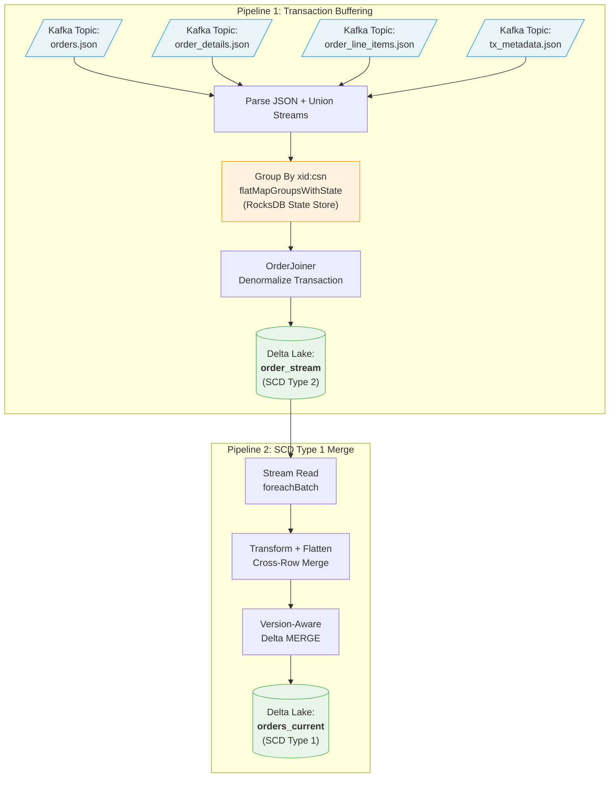

# Building Transactionally Consistent CDC Pipelines with Spark Structured Streaming and Delta Lake

*How to buffer, join, and materialize multi-table CDC events without losing transactional consistency — using flatMapGroupsWithState, RocksDB, and version-aware Delta MERGE.*

---

## The Problem: CDC Events Arrive Out of Order and Across Topics

Change Data Capture (CDC) is a cornerstone of modern data architectures. Tools like Oracle GoldenGate, Debezium, and AWS DMS capture row-level changes from source databases and publish them as events. But there's a fundamental tension: **relational databases commit transactions atomically, while CDC tools emit events one row at a time, often across separate topics.**

Consider an e-commerce order system with three related tables:

```
orders (1) ──→ order_details (1:1) ──→ order_line_items (1:N)
```

When a customer places an order, a single database transaction inserts rows into all three tables. GoldenGate captures each insert as a separate CDC event and publishes them to separate Kafka topics. At the consumer, these events arrive independently — potentially out of order, across different partitions, at different times.

If you naively process each event in isolation, you end up with partial records in your data lake: an order without its line items, line items without their parent order, or — worse — a half-committed transaction that was rolled back at the source.

**The core challenge: How do you reconstruct transactional consistency in a streaming pipeline?**

This article walks through a production-grade solution built with Spark 4.0 Structured Streaming, Delta Lake 4.0, and Oracle GoldenGate. The full source code is available on GitHub.

---

## Architecture: A Two-Pipeline Design

The system is composed of two Spark Structured Streaming applications that form a pipeline chain:



**Pipeline 1 (TransactionalCdcProcessingApp)** solves the consistency problem: it buffers CDC events per transaction and only emits a denormalized record when the transaction is complete. The output is an SCD Type 2 table — every transaction creates a new row, preserving full history.

**Pipeline 2 (ScdType1MergeApp)** maintains a current-state view: it reads the Type 2 stream and merges changes into a Type 1 table using entity-level version tracking.

---

## Pipeline 1: Transaction-Aware Buffering

### The Key Insight: Transaction Metadata

Oracle GoldenGate (and similar tools) can emit a **transaction metadata event** alongside the CDC events. This metadata contains the transaction's `xid` (transaction ID), `csn` (commit sequence number), and — critically — the **expected event count per table**:

```json
{
  "xid": "1342848513.2.24.5354",
  "csn": "334516829",
  "tx_ts": "2026-02-17 10:15:30.000000",
  "event_count": 6,
  "data_collections": [
    { "data_collection": "ORDERS",            "event_count": 1 },
    { "data_collection": "ORDER_DETAILS",     "event_count": 1 },
    { "data_collection": "ORDER_LINE_ITEMS",  "event_count": 4 }
  ]
}
```

This tells us: *"Transaction 1342848513.2.24.5354 touched 6 rows: 1 order, 1 order detail, and 4 line items. Don't emit anything until you have all 6."*

### Reading Four Kafka Topics

The application subscribes to four Kafka topics — one per source table plus the metadata topic:

```scala
val ordersRaw      = readKafkaStream(spark, config, "dev.appuser.orders.json")
val detailsRaw     = readKafkaStream(spark, config, "dev.appuser.order_details.json")
val lineItemsRaw   = readKafkaStream(spark, config, "dev.appuser.order_line_items.json")
val txMetadataRaw  = readKafkaStream(spark, config, "dev.transaction_metadata_json")
```

Each stream is parsed from JSON into a structured schema, tagged with its event type (table name or `METADATA`), and then unioned into a single stream:

```scala
val allEvents = orderEvents
  .union(orderDetailEvents)
  .union(orderLineItemEvents)
  .union(txMetadataEvents)
  .filter(col("xid").isNotNull.and(col("csn").isNotNull))
```

### Stateful Processing with flatMapGroupsWithState

The unified stream is grouped by transaction key (`xid:csn`) and processed with `flatMapGroupsWithState` — Spark's most powerful stateful operator:

```scala
val joinedOrders: Dataset[OrderStream] = allEvents
  .groupByKey(row =>
    row.getString(row.fieldIndex("xid")) + ":" +
    row.getString(row.fieldIndex("csn")))
  .flatMapGroupsWithState(
    OutputMode.Append(),
    GroupStateTimeout.NoTimeout()
  )(processTransaction)
```

The `processTransaction` function implements a simple but effective state machine:

```scala
private def processTransaction(
    txKey: String,
    events: Iterator[Row],
    state: GroupState[TransactionState]): Iterator[OrderStream] = {

  val txState = if (state.exists) state.get else new TransactionState()

  // Buffer events
  while (events.hasNext) {
    val row = events.next()
    val eventType = row.getAs[String]("event_type")

    if ("METADATA" == eventType) {
      txState.setMetadata(/* parse metadata with expected counts */)
    } else {
      txState.addEvent(/* parse CDC event, route by table name */)
    }
  }

  // Check completeness
  if (txState.isComplete) {
    val results = OrderJoiner.joinTransaction(txState)
    state.remove()    // Clear state after emission
    results.iterator
  } else {
    state.update(txState)
    Iterator.empty     // Not ready yet — keep buffering
  }
}
```

### TransactionState: The Buffering Engine

`TransactionState` is a `Serializable` class that tracks both the expected and received events:

```scala
class TransactionState extends Serializable {
  var orderEvents: List[DataChangeEvent]         = new ArrayList()
  var orderDetailEvents: List[DataChangeEvent]   = new ArrayList()
  var orderLineItemEvents: List[DataChangeEvent] = new ArrayList()

  private var _expectedOrderCount: Int = 0
  private var _expectedOrderDetailCount: Int = 0
  private var _expectedOrderLineItemCount: Int = 0

  def addEvent(event: DataChangeEvent): Unit = event.tableName match {
    case "ORDERS"           => orderEvents.add(event)
    case "ORDER_DETAILS"    => orderDetailEvents.add(event)
    case "ORDER_LINE_ITEMS" => orderLineItemEvents.add(event)
  }

  def isComplete: Boolean =
    _metadata != null &&
      orderEvents.size     >= _expectedOrderCount &&
      orderDetailEvents.size >= _expectedOrderDetailCount &&
      orderLineItemEvents.size >= _expectedOrderLineItemCount
}
```

This state is persisted in RocksDB via Spark's state store, surviving application restarts and failures. Events accumulate across micro-batches until the transaction is complete.

### OrderJoiner: Denormalizing the Transaction

When `isComplete` returns true, `OrderJoiner.joinTransaction()` converts the buffered events into denormalized `OrderStream` records:

```scala
object OrderJoiner {
  def joinTransaction(state: TransactionState): Seq[OrderStream] = {
    val orderMap = HashMap[Double, OrderStream]()

    // Process order events → build Order with before image
    for (event <- state.orderEvents) {
      val order = convert(event.after, classOf[Order])
      order.before = if (event.before != null)
        convert(event.before, classOf[OrderBefore]) else null

      val os = orderMap.getOrElseUpdate(
        order.orderId,
        newOrderStream(order.orderId, state))
      os.orders.add(order)
    }

    // Process order details → same pattern
    // Process line items → same pattern

    orderMap.values.toSeq
  }
}
```

The CDC events use `Map[String, String]` for both `before` and `after` images. Jackson's `ObjectMapper.treeToValue()` coerces the string values to typed fields (e.g., `"100.50"` → `Double`). The `before` image is preserved for audit — it's `null` for inserts and populated for updates.

### Output: SCD Type 2 Delta Table

The denormalized records are written to a Delta Lake table called `order_stream`:

```scala
joinedOrders.writeStream
  .format("delta")
  .option("checkpointLocation", checkpointLocation)
  .outputMode(OutputMode.Append())
  .toTable("order_stream")
```

Each record captures the full transaction context:

```json
{
  "xid": "1342848513.2.24.5354",
  "csn": "334516829",
  "orderId": 248.0,
  "orders": [{
    "orderId": 248.0, "orderRef": "ORD-001",
    "version": 2.0, "orderStatus": "CONFIRMED",
    "before": { "version": 1.0, "orderStatus": "PENDING" }
  }],
  "orderDetails": [{ "shippingMethod": "EXPRESS", "carrier": "FEDEX" }],
  "lineItems": [
    { "lineItemId": 1.0, "productId": "PROD-100", "itemQty": 600.0 },
    { "lineItemId": 2.0, "productId": "PROD-200", "itemQty": 400.0 }
  ]
}
```

This is an SCD Type 2 representation — every transaction creates a new row, preserving full history with before images.

---

## Pipeline 2: SCD Type 1 Merge with Entity-Level Versioning

The `order_stream` table is great for auditing and history, but operational dashboards need current state. That's `ScdType1MergeApp` — it reads the Type 2 stream and maintains a Type 1 table where each order appears exactly once with its latest values.

### The Challenge: Independent Entity Versioning

A critical insight drives the merge logic: **parent and child entities version independently.** A transaction might update only line items without touching the order itself. The order stays at version 3 while its line items advance to version 5. The merge must handle this: update children without overwriting the parent, and vice versa.

### Transform: Cross-Row Merging

Within a single micro-batch, multiple `order_stream` records can reference the same `orderId` — one from the order creation, another from a later line-item update. The transform step must combine them, not just pick one.

```scala
private def transformSourceBatch(batchDF: Dataset[Row]): Dataset[Row] = {
  // Dedup within arrays (e.g., multiple versions of same line item)
  val latestOrder      = dedupExpr("orders", "orderId")
  val latestDetail     = dedupExpr("orderDetails", "orderId")
  val dedupLineItems   = dedupExpr("lineItems", "lineItemId")

  // Safely extract from potentially empty arrays
  val safeOrder  = s"try_element_at($latestOrder, 1)"
  val safeDetail = s"try_element_at($latestDetail, 1)"

  val flattened = batchDF.selectExpr(
    "orderId",
    s"$safeOrder.version as version",
    s"$safeOrder.orderStatus as orderStatus",
    // ... flatten all order fields ...
    s"$safeDetail as orderDetails",
    s"$dedupLineItems as lineItems"
  )

  // Step 1: Best row for order-level fields (highest version)
  val bestOrderRow = flattened
    .withColumn("_rn", row_number().over(
      Window.partitionBy("orderId")
        .orderBy(col("version").desc_nulls_last)))
    .filter("_rn = 1")
    .drop("_rn", "orderDetails", "lineItems")

  // Step 2: Best orderDetails (non-null, highest version)
  val bestDetails = flattened
    .filter("orderDetails IS NOT NULL")
    .withColumn("_rn", row_number().over(
      Window.partitionBy("orderId")
        .orderBy(col("orderDetails.version").desc_nulls_last)))
    .filter("_rn = 1")
    .select("orderId", "orderDetails")

  // Step 3: Merge lineItems from ALL rows, dedup by lineItemId
  val mergedLineItems = flattened
    .filter("lineItems IS NOT NULL AND size(lineItems) > 0")
    .groupBy("orderId")
    .agg(flatten(collect_list(col("lineItems"))).as("_all"))
    .selectExpr("orderId",
      s"${dedupExpr("_all", "lineItemId")} as lineItems")

  // Combine via left joins
  bestOrderRow
    .join(bestDetails, Seq("orderId"), "left")
    .join(mergedLineItems, Seq("orderId"), "left")
}
```

The `dedupExpr` helper uses Spark's higher-order array functions to keep only the highest-version element for each key:

```scala
private def dedupExpr(arrayField: String, keyField: String): String =
  s"""filter($arrayField, e ->
       NOT exists($arrayField, other ->
         other.$keyField = e.$keyField AND other.version > e.version))"""
```

### The Version-Aware Delta MERGE

The merge uses two `whenMatched` clauses evaluated in order — a pattern that elegantly separates parent updates from child-only updates:

```scala
val orderSourceWins =
  "source.version IS NOT NULL AND source.version > COALESCE(target.version, 0)"

targetTable.alias("target")
  .merge(transformed.alias("source"), "target.orderId = source.orderId")

  // Clause 1: Source has a newer order version — update everything
  .whenMatched(orderSourceWins)
  .updateExpr(Map(
    "orderRef"     -> "source.orderRef",
    "version"      -> "source.version",
    "orderStatus"  -> "source.orderStatus",
    // ... all order fields from source ...
    "orderDetails" -> mergedDetails,     // version-aware child merge
    "lineItems"    -> mergedLineItems    // version-aware child merge
  ))

  // Clause 2: No order update — preserve order fields, merge children only
  .whenMatched()
  .updateExpr(Map(
    "orderDetails" -> mergedDetails,
    "lineItems"    -> mergedLineItems
  ))

  // Only insert rows that have order data (prevents incomplete rows)
  .whenNotMatched("source.version IS NOT NULL")
  .insertAll()
  .execute()
```

The child merge expressions handle the independent versioning:

**For structs (1:1 relationships like orderDetails):**

```scala
private def mergeStructExpr(field: String): String =
  s"""CASE
     |  WHEN source.$field IS NULL THEN target.$field
     |  WHEN target.$field IS NULL THEN source.$field
     |  WHEN source.$field.version > COALESCE(target.$field.version, 0)
     |    THEN source.$field
     |  ELSE target.$field
     |END"""
```

**For arrays (1:N relationships like lineItems):**

```scala
private def mergeArrayExpr(arrayField: String, keyField: String): String =
  s"""CASE
     |  WHEN source.$arrayField IS NULL OR size(source.$arrayField) = 0
     |    THEN target.$arrayField
     |  WHEN target.$arrayField IS NULL OR size(target.$arrayField) = 0
     |    THEN source.$arrayField
     |  ELSE concat(
     |    filter(source.$arrayField, se ->
     |      NOT exists(target.$arrayField, te ->
     |        te.$keyField = se.$keyField AND te.version >= se.version)),
     |    filter(target.$arrayField, te ->
     |      NOT exists(source.$arrayField, se ->
     |        se.$keyField = te.$keyField AND se.version > te.version))
     |  )
     |END"""
```

This `concat + filter` pattern is key: it produces a merged array where each element has the highest version. Source elements replace target elements with the same key when the source version is higher; target elements are preserved when the source doesn't have a newer version.

---

## The Source Schema: Oracle Tables with Version Triggers

The source database uses three tables related by `ORDER_ID`, with `VERSION` columns that auto-increment via triggers:

```sql
CREATE TABLE orders (
  order_id    NUMBER(19,0) GENERATED ALWAYS AS IDENTITY PRIMARY KEY,
  order_ref   VARCHAR2(64) NOT NULL UNIQUE,
  version     NUMBER(10,0) DEFAULT 1 NOT NULL,
  order_date  DATE NOT NULL,
  order_status VARCHAR2(16) NOT NULL,
  total_amount NUMBER(20,4) NOT NULL,
  -- ... more fields ...
);

CREATE TABLE order_line_items (
  line_item_id NUMBER(19,0) GENERATED ALWAYS AS IDENTITY PRIMARY KEY,
  order_id     NUMBER(19,0) NOT NULL REFERENCES orders(order_id),
  version      NUMBER(10,0) DEFAULT 1 NOT NULL,
  product_id   VARCHAR2(64) NOT NULL,
  item_qty     NUMBER(18,4) NOT NULL,
  item_price   NUMBER(18,8),
  -- ... more fields ...
);

-- Auto-increment version on update
CREATE OR REPLACE TRIGGER trg_orders_version
  BEFORE UPDATE ON orders FOR EACH ROW
BEGIN
  :NEW.version := :OLD.version + 1;
END;
/
```

The `VERSION` column serves dual purposes:
1. **Optimistic locking** at the application layer
2. **Version-aware merging** in the downstream pipeline

---

## Lessons Learned: Pitfalls and Solutions

### 1. Spark 4.0 ANSI Mode Breaks Array Access

Spark 4.0 enables ANSI mode by default. Accessing `array[0]` on an empty array throws `INVALID_ARRAY_INDEX` instead of returning `null`. When a transaction only updates line items (no order changes), the `orders` array is empty.

**Fix:** Use `try_element_at(array, 1)` (1-based index) which returns `null` for empty arrays:

```scala
// Before (throws in ANSI mode)
s"$latestOrder[0].orderRef as orderRef"

// After (null-safe)
val safeOrder = s"try_element_at($latestOrder, 1)"
s"$safeOrder.orderRef as orderRef"
```

### 2. Cross-Row Dedup Silently Drops Child Updates

The original design used `row_number()` to pick one row per `orderId` (highest version). This works when each batch has one record per order. But when the batch contains both an order creation (version=1) and a subsequent line-item-only update (version=null), the dedup keeps the creation row and discards the line-item changes.

**Fix:** A three-step merge that combines data from all rows:
- Order fields: from the row with the highest version
- orderDetails: best non-null struct across all rows
- lineItems: `flatten(collect_list(...))` to merge arrays, then dedup

### 3. Table Existence Check: isDeltaTable vs catalog.tableExists

`DeltaTable.isDeltaTable(spark, "orders_current")` can interpret the string as a file path rather than a table name, returning `false` even when the table exists in the Hive catalog. This causes the table to be recreated with `overwrite` on every batch.

**Fix:** Use the unambiguous `spark.catalog.tableExists(tableName)`:

```scala
// Before (may interpret as path)
if (!DeltaTable.isDeltaTable(spark, targetTableName))

// After (always resolves through catalog)
if (!spark.catalog.tableExists(targetTableName))
```

### 4. Java 17 Module System and Hive Metastore

Spark 4.0 with Hive support on Java 17 requires `--add-opens` JVM arguments. Without them, Hive's `StringInternUtils` fails with `InaccessibleObjectException`.

**Fix:** Create `.mvn/jvm.config` for builds, and add VM options to IDE run configurations:

```
--add-opens java.base/java.net=ALL-UNNAMED
--add-opens java.base/java.util=ALL-UNNAMED
--add-opens java.base/java.lang=ALL-UNNAMED
--add-opens java.base/java.nio=ALL-UNNAMED
```

### 5. Preventing Incomplete Row Insertions

A line-item-only transaction produces a row with `null` order fields. Without a guard, `whenNotMatched().insertAll()` inserts a row with null order fields and populated line items — an incomplete record.

**Fix:** Condition the insert on having order data:

```scala
// Before (inserts incomplete rows)
.whenNotMatched().insertAll()

// After (only inserts when order data is present)
.whenNotMatched("source.version IS NOT NULL").insertAll()
```

---

## Why Not Flink?

This project is a Spark port of an existing Flink implementation. The two approaches differ in fundamental ways:

| Aspect | Flink | Spark |
|--------|-------|-------|
| **Transaction completion** | Custom LSN-based watermarks | Event count matching from metadata |
| **State backend** | Keyed state with RocksDB | Spark state store with RocksDB |
| **API** | DataStream v2 custom operators | Structured Streaming `flatMapGroupsWithState` |
| **Output** | Kafka topics | Delta Lake tables |
| **SCD handling** | Downstream | Built-in dual pipeline |

The Flink implementation uses watermarks derived from Log Sequence Numbers (LSN) to determine transaction boundaries — a more sophisticated approach that doesn't require explicit event counts. Spark's Structured Streaming doesn't support custom watermark advancement, so we rely on the metadata event's per-table counts instead.

The trade-off: Spark's approach is simpler to implement and debug, but it requires the CDC tool to emit transaction metadata with accurate event counts. Flink's watermark approach is more resilient to metadata loss but requires custom operator implementation.

---

## Production Considerations

### State Growth

The biggest operational risk is unbounded state growth. If a transaction's metadata event is lost (or arrives with incorrect counts), the transaction will buffer indefinitely. Monitor state store size and consider implementing:

- **TTL-based eviction** for incomplete transactions
- **Alerting** on transactions buffered longer than a threshold
- **Dead letter queue** for expired transactions

### Checkpointing

Both pipelines use checkpointing for exactly-once semantics. In production:

- Use HDFS or S3 for checkpoint storage (not local filesystem)
- Monitor checkpoint duration as a proxy for state store health
- Never delete checkpoints unless you're prepared to reprocess from scratch

### Delta Lake Maintenance

The `order_stream` table grows append-only. Schedule regular maintenance:

```sql
-- Remove old file versions (default 7-day retention)
VACUUM order_stream;

-- Compact small files
OPTIMIZE order_stream ZORDER BY (orderId);

-- Update statistics for query planning
ANALYZE TABLE order_stream COMPUTE STATISTICS FOR ALL COLUMNS;
```

---

## Conclusion

Transactional consistency in CDC pipelines is a solved problem — but the solution requires intentional design. The key ideas:

1. **Buffer by transaction, not by table.** Group events by transaction ID and only emit when the transaction is complete.
2. **Version entities independently.** Parent and child entities change at different rates. Track versions separately.
3. **Use metadata for completeness checks.** Transaction metadata tells you how many events to expect — use it as a termination condition.
4. **Merge, don't overwrite.** Delta MERGE with version-aware expressions preserves existing data while applying targeted updates.
5. **Separate history from current state.** SCD Type 2 for audit trails, SCD Type 1 for operational queries. Each has different access patterns and maintenance needs.

The combination of Spark Structured Streaming's `flatMapGroupsWithState`, RocksDB-backed state persistence, and Delta Lake's ACID MERGE provides a robust foundation for transactionally consistent CDC processing at scale.

---

*Built with Spark 4.0, Delta Lake 4.0, Scala 2.13, and Oracle GoldenGate. The full source code is available on GitHub.*
