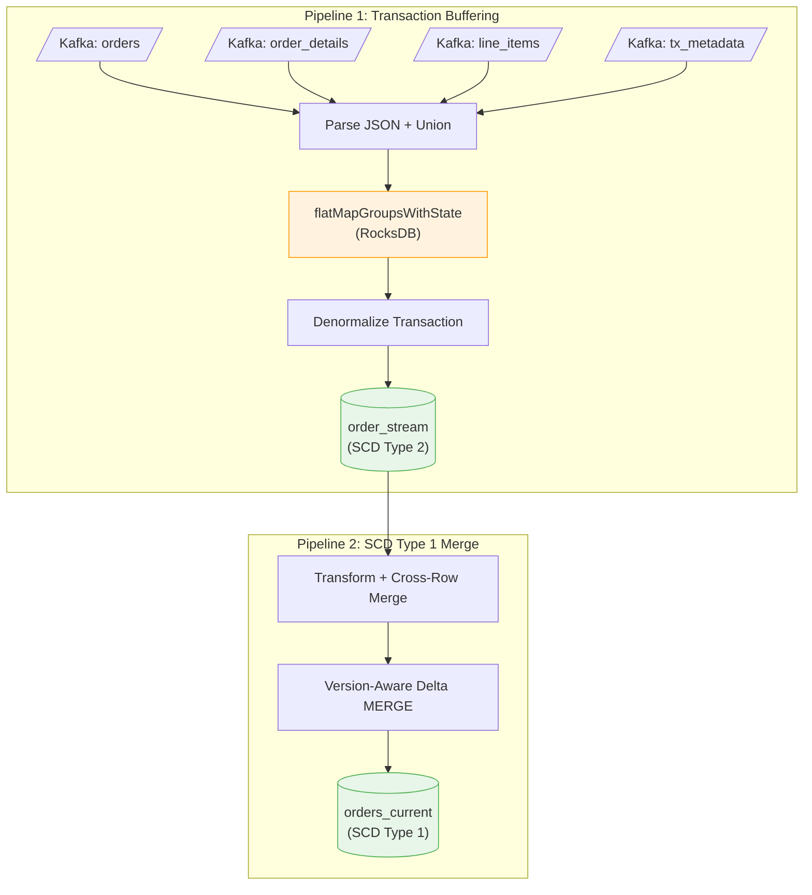

# Building Transactionally Consistent CDC Pipelines with Spark Structured Streaming

*How to buffer, join, and materialize multi-table CDC events without losing transactional consistency.*

---

## The Problem

CDC tools like Oracle GoldenGate capture row-level changes and publish them as events. But there's a fundamental tension: **databases commit transactions atomically, while CDC tools emit events one row at a time across separate topics.**

Consider three related tables: `orders`, `order_details`, and `order_line_items`. A single transaction inserts rows into all three, but the CDC events arrive independently — potentially out of order, at different times. Process them naively and you get partial records: orders without line items, or half-committed transactions that were rolled back at the source.

---

## The Solution: Two-Pipeline Architecture



**Pipeline 1** buffers CDC events per transaction and only emits when the transaction is complete. **Pipeline 2** maintains a current-state view via version-aware Delta MERGE.

---

## Pipeline 1: Transaction-Aware Buffering

### The Key Insight: Transaction Metadata

GoldenGate emits a metadata event containing the **expected event count per table**:

```json
{
  "xid": "1342848513.2.24.5354",
  "csn": "334516829",
  "data_collections": [
    { "data_collection": "ORDERS",            "event_count": 1 },
    { "data_collection": "ORDER_DETAILS",     "event_count": 1 },
    { "data_collection": "ORDER_LINE_ITEMS",  "event_count": 4 }
  ]
}
```

This tells us: *don't emit anything until you have all 6 events.*

### Stateful Processing

Four Kafka streams are unioned and grouped by transaction key (`xid:csn`). Spark's `flatMapGroupsWithState` buffers events in RocksDB-backed state:

```scala
val joinedOrders = allEvents
  .groupByKey(row => row.getAs[String]("xid") + ":" + row.getAs[String]("csn"))
  .flatMapGroupsWithState(OutputMode.Append(), GroupStateTimeout.NoTimeout())(
    processTransaction)
```

The state machine is simple: buffer events, check counts, emit when complete:

```scala
def isComplete: Boolean =
  _metadata != null &&
    orderEvents.size     >= _expectedOrderCount &&
    orderDetailEvents.size >= _expectedOrderDetailCount &&
    orderLineItemEvents.size >= _expectedOrderLineItemCount
```

When complete, `OrderJoiner` denormalizes the buffered events into a single record with nested `orders`, `orderDetails`, and `lineItems` arrays — each carrying a `before` image for audit. The state is then cleared.

---

## Pipeline 2: Version-Aware SCD Type 1 Merge

The `order_stream` table preserves full history, but dashboards need current state. The merge pipeline has two key design challenges.

### Challenge 1: Cross-Row Merging

A single micro-batch can contain multiple records for the same order — one from creation, another from a child-only update. A naive `row_number()` dedup picks one row and silently drops the other's changes.

The fix: a three-step merge that combines data from ALL rows per `orderId`:

1. **Order fields** — from the row with the highest version
2. **orderDetails** — best non-null struct across all rows
3. **lineItems** — `flatten(collect_list(...))` merges arrays from all rows, then deduplicates by `lineItemId` keeping the highest version

### Challenge 2: Independent Entity Versioning

Parent and child entities version independently. A transaction might update only line items without touching the order itself. The merge uses two `whenMatched` clauses:

```scala
// Clause 1: Source order version is newer — update everything
.whenMatched("source.version IS NOT NULL AND source.version > target.version")
.updateExpr(Map(/* all order fields + merged children */))

// Clause 2: No order update — preserve order fields, merge children only
.whenMatched()
.updateExpr(Map(
  "orderDetails" -> mergeStructExpr("orderDetails"),
  "lineItems"    -> mergeArrayExpr("lineItems", "lineItemId")
))
```

The array merge uses a `concat + filter` pattern with higher-order functions:

```scala
// Keep source elements with higher version, preserve unmatched target elements
concat(
  filter(source.lineItems, se ->
    NOT exists(target.lineItems, te ->
      te.lineItemId = se.lineItemId AND te.version >= se.version)),
  filter(target.lineItems, te ->
    NOT exists(source.lineItems, se ->
      se.lineItemId = te.lineItemId AND se.version > te.version))
)
```

---

## Pitfalls We Hit

**Spark 4.0 ANSI mode** — `array[0]` on an empty array throws instead of returning null. Fix: use `try_element_at(array, 1)`.

**isDeltaTable vs tableExists** — `DeltaTable.isDeltaTable(spark, "table_name")` can interpret the string as a file path, returning `false` for catalog-registered tables. Fix: use `spark.catalog.tableExists()`.

**Incomplete inserts** — A child-only transaction has null order fields. Without a guard, `whenNotMatched().insertAll()` creates incomplete rows. Fix: `whenNotMatched("source.version IS NOT NULL")`.

**Java 17 modules** — Spark 4.0 with Hive on JDK 17 requires `--add-opens` flags for `java.base` packages.

---

## Key Takeaways

1. **Buffer by transaction, not by table.** Use transaction metadata event counts as the completeness condition.
2. **Version entities independently.** Orders, details, and line items change at different rates — track versions per entity.
3. **Merge across rows, not just across tables.** Multiple records for the same key in a single batch must be combined, not deduplicated.
4. **Merge, don't overwrite.** Delta MERGE with version-aware expressions preserves existing data while applying targeted updates.
5. **Separate history from current state.** SCD Type 2 for audit, Type 1 for operations — each with different maintenance needs.

---

*Built with Spark 4.0, Delta Lake 4.0, Scala 2.13, and Oracle GoldenGate.*
