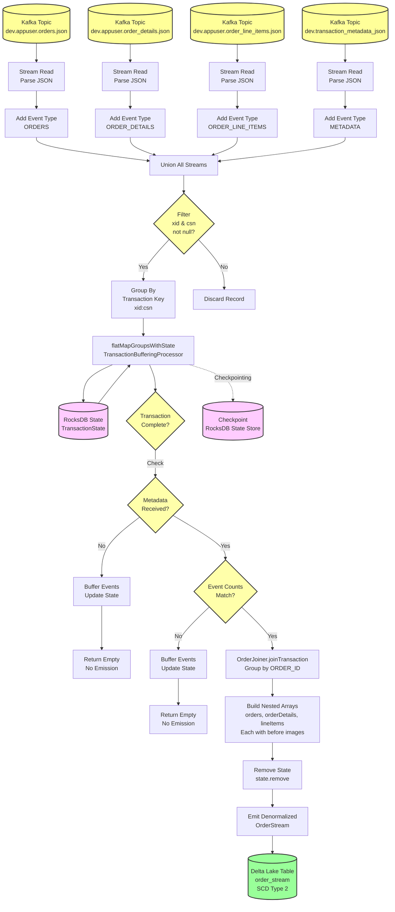
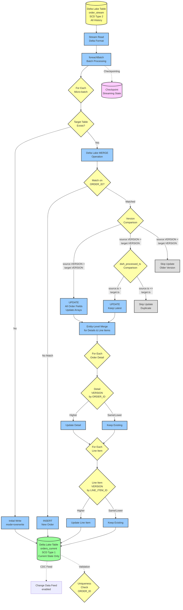
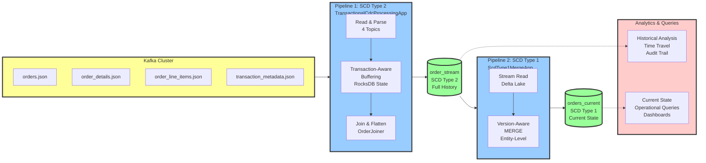
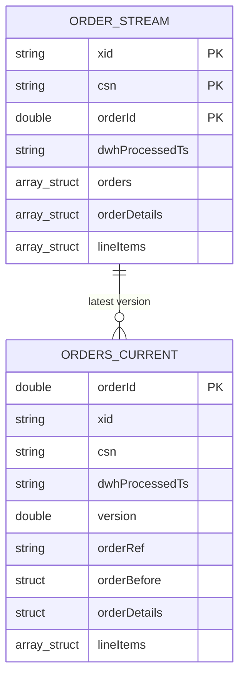
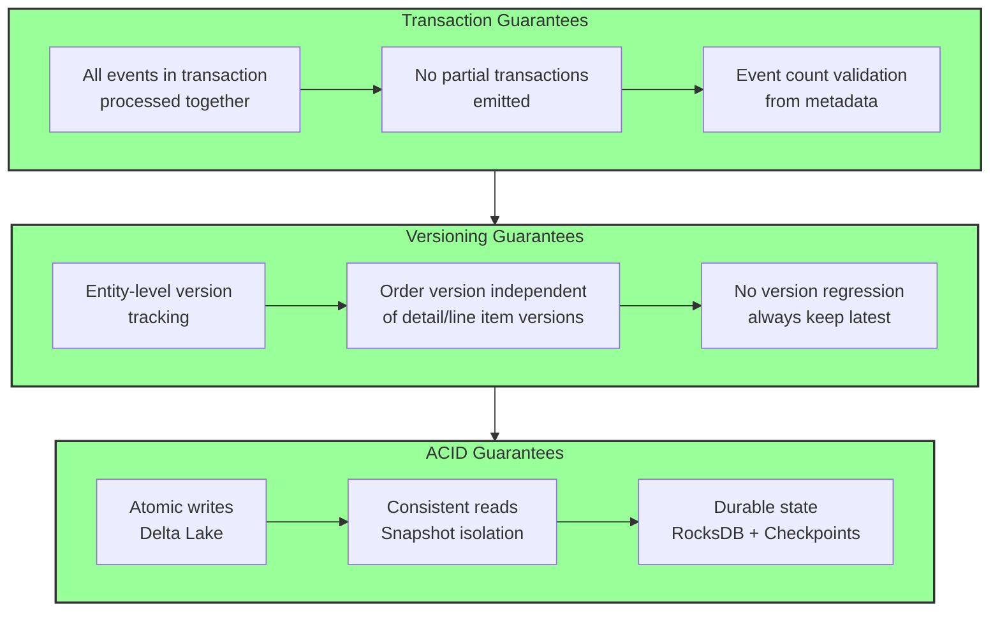

# Pipeline Architecture Diagrams

This document contains Mermaid diagrams illustrating the architecture of both CDC processing pipelines.

## Pipeline 1: SCD Type 2 - Transactional CDC Processing

This pipeline reads CDC events from Kafka, performs transaction-aware buffering, and writes to an SCD Type 2 Delta Lake table with full history.

### Key Components

| Component | Description |
|-----------|-------------|
| **Kafka Topics** | 4 source topics for orders, order_details, order_line_items, and transaction metadata |
| **Stream Processing** | Parse JSON and add event type markers |
| **Union** | Combine all 4 streams into single stream |
| **Filter** | Remove records without transaction identifiers |
| **Group By** | Group events by transaction key (xid:csn) |
| **State Management** | RocksDB-backed stateful processing with TransactionState |
| **Transaction Logic** | Buffer until metadata received and event counts match |
| **OrderJoiner** | Join all events by ORDER_ID, flatten attributes, add before images |
| **Delta Lake Output** | Write denormalized records to SCD Type 2 table |

---

## Pipeline 2: SCD Type 1 - Current State Maintenance

This pipeline reads from the SCD Type 2 table and maintains an SCD Type 1 table with only the latest version of each order using entity-level versioning.

### Key Components

| Component | Description |
|-----------|-------------|
| **Source** | Delta Lake SCD Type 2 table with full history |
| **Stream Read** | Continuous reading from Delta Lake in streaming mode |
| **foreachBatch** | Micro-batch processing for complex merge logic |
| **Delta MERGE** | ACID merge operation based on ORDER_ID |
| **Version Comparison** | Compare VERSION fields at entity level |
| **Entity-Level Merge** | Independent version tracking for order, order details, line items |
| **Duplicate Handling** | Skip records with same version using timestamp tiebreaker |
| **SCD Type 1 Output** | Maintain only current state of each order |
| **Change Data Feed** | Track changes to current state |

---

## Complete End-to-End Flow

---

## Data Model Comparison

### Schema Differences

| Aspect | SCD Type 2 (order_stream) | SCD Type 1 (orders_current) |
|--------|---------------------------|-------------------------------|
| **Primary Key** | (xid, csn, orderId) - Composite | orderId - Single |
| **Order Structure** | Nested `orders ARRAY<STRUCT>` | Flattened top-level fields |
| **Order Details** | `ARRAY<STRUCT>` with before | Single `STRUCT` with before (1:1) |
| **Line Items** | `ARRAY<STRUCT>` with before | `ARRAY<STRUCT>` with before (1:N) |
| **Records per Order** | Multiple (all versions) | One (current only) |
| **Inserts** | Always append new versions | Upsert based on version |
| **Updates** | Never update, only insert | Update in place if version higher |
| **Before Images** | Inside each array element | `orderBefore` struct + inside details/items |
| **Use Case** | Historical analysis, audit | Current state queries |

---

## Processing Guarantees

